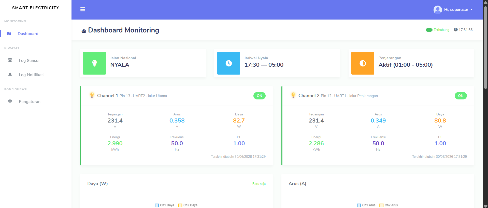
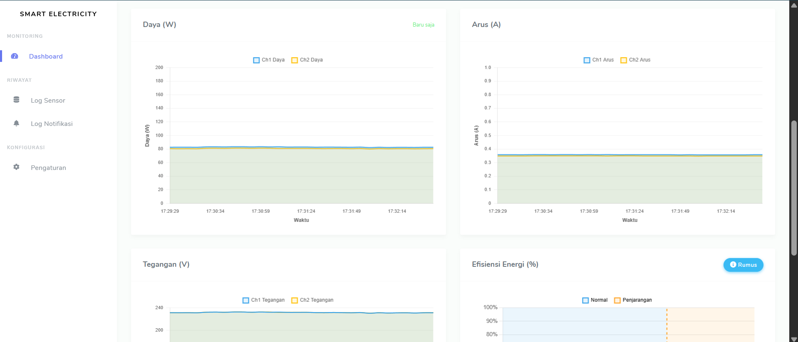
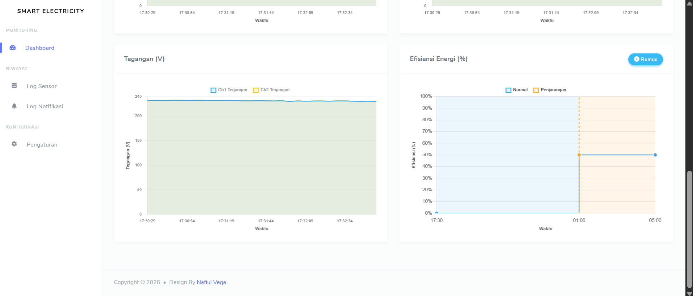
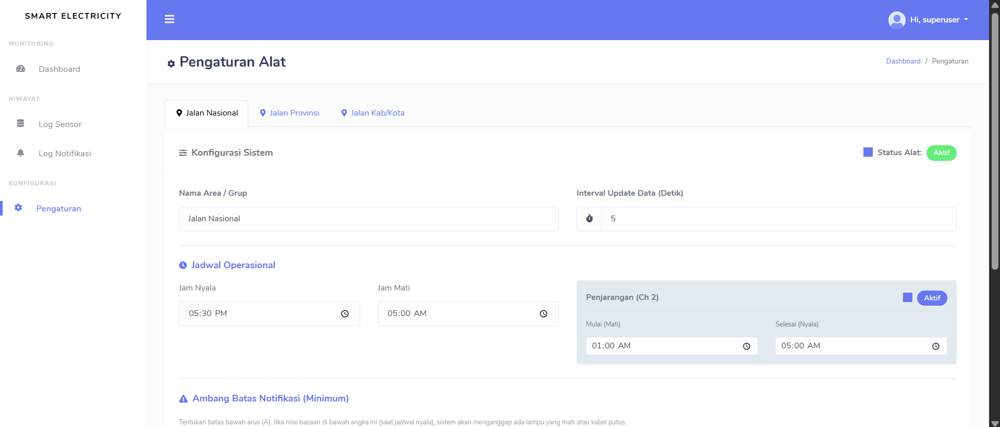
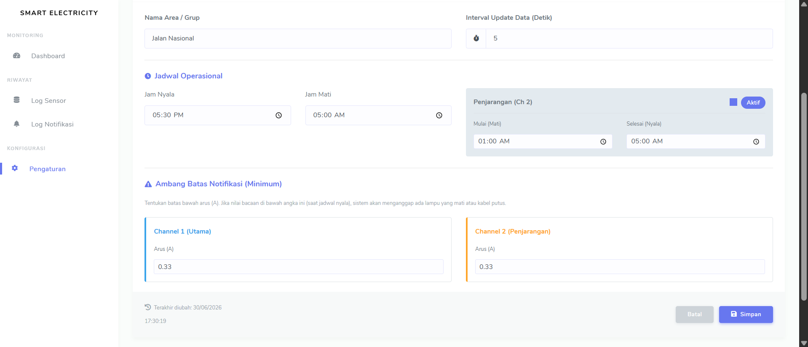
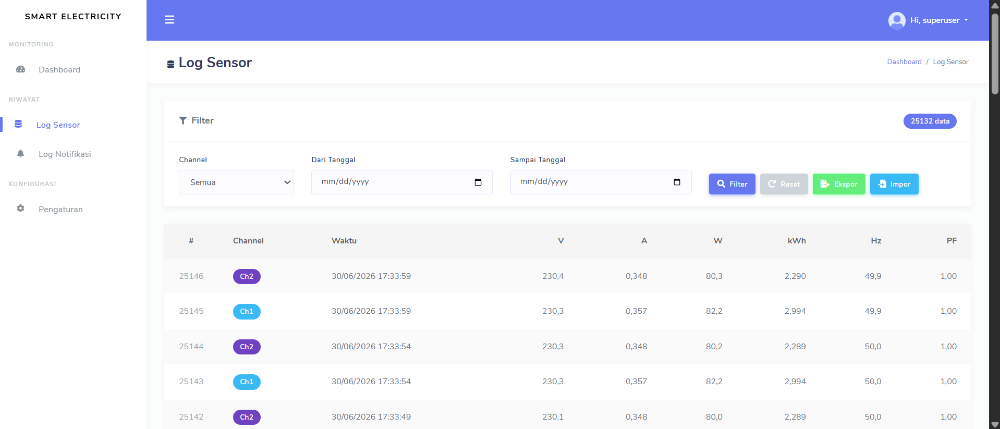
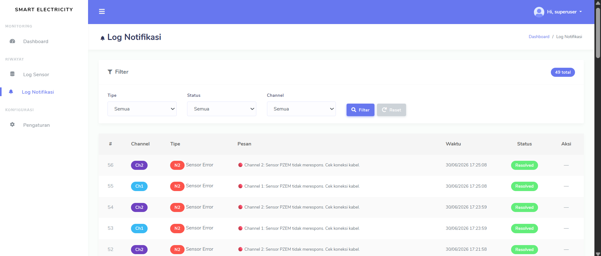
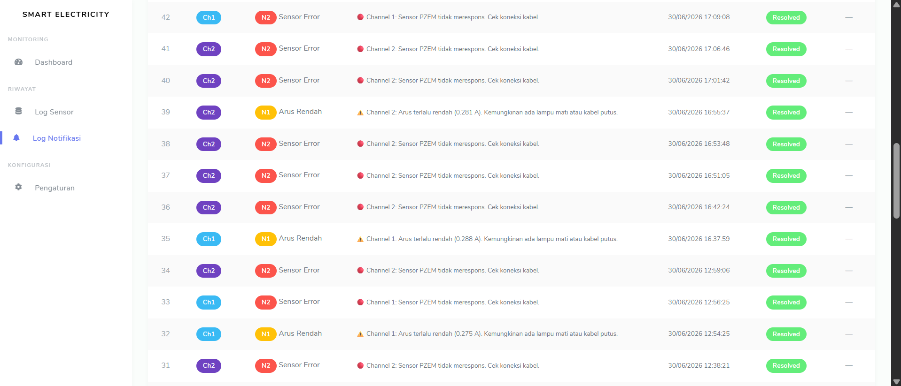

# Smart Electricity (SMEL)

Smart Electricity (SMEL) adalah sebuah platform berbasis web yang digunakan untuk memantau dan mengontrol lampu jalan secara terpusat. Sistem ini terhubung dengan perangkat **ESP32** dan sensor **PZEM-004T** melalui REST API dan menggunakan protokol **WebSocket** (via Django Channels) untuk menyajikan data secara real-time tanpa perlu me-refresh halaman (dashboard mobile-first).

Proyek ini dibuat sebagai prototipe sistem otomatisasi lampu jalan yang terintegrasi dan dapat mengontrol konsumsi daya dengan mengimplementasikan pengaturan jadwal nyala/mati lampu serta sistem penjarangan untuk meningkatkan efisiensi energi.

---

## 🚀 Fitur Utama

- **Monitoring Real-Time (WebSocket):** Menampilkan data tegangan (V), arus (A), daya (W), energi (kWh), frekuensi (Hz), dan power factor (PF) secara langsung di dashboard.
- **Kendali Jadwal (Nyala/Mati):** Pengaturan jadwal lampu secara otomatis (mendukung _crossing_ tengah malam, misal 17:30 - 05:00).
- **Fitur Penjarangan (Half-Night Dimming):** Mematikan sebagian lampu pada jam tertentu (misal: 01:00 - 04:00) untuk menghemat energi tanpa mematikan penerangan jalan sepenuhnya.
- **Logika Cerdas Pemanasan & Putus Mendadak:** Toleransi pemanasan awal sensor PZEM-004T untuk menghindari false-alarm saat relay baru dinyalakan.

---

## 🛠️ Arsitektur Hardware & Pemetaan Pin

Sistem dirancang untuk **1 Grup (Jalan Nasional)** yang memiliki **2 Channel Relay** (total mengontrol 10 lampu, masing-masing channel 5 lampu).

| Channel | Relay Pin | PZEM UART RX | PZEM UART TX | PZEM Address | Keterangan |
| :--- | :--- | :--- | :--- | :--- | :--- |
| **1** | GPIO 13 | GPIO 16 (UART2) | GPIO 17 (UART2) | `0x10` | Pin utama, selalu menyala saat jadwal aktif. |
| **2** | GPIO 12 | GPIO 18 (UART1) | GPIO 19 (UART1) | `0x10` | Pin penjarangan, dimatikan saat jam penjarangan. |

---

## 💻 Tech Stack & Software

- **Backend:** Python, Django 5.x, Django Channels (ASGI)
- **Database:** PostgreSQL (berdasarkan `psycopg2-binary`) / SQLite
- **Real-Time & Message Broker:** Redis, WebSocket
- **Hardware:** ESP32, Relay 2 Channel, PZEM-004T (V3.0)
- **Dependencies:** Pandas, NumPy, ReportLab, OpenPyXL (untuk export laporan)

---

## 📂 Struktur Proyek

- **`app/`**: Berisi logika aplikasi Django (models, views, routing WebSocket, consumers, dan antarmuka web).
- **`config/`**: Pengaturan utama Django, konfigurasi ASGI/WSGI, dan rute URL utama.
- **`esp32/`**: Kode C/C++ (Arduino IDE) untuk diunggah ke perangkat ESP32.

---

## 📸 Tangkapan Layar (Screenshots)

- **Dashboard Utama:**
  
  
  

- **Pengaturan Jadwal:**
  
  

- **Log Data Sensor:**
  

- **Log Notifikasi:**
  
  

---

## 🗺️ Skema / Topologi Jaringan

Sistem ini memiliki alur komunikasi antar-node sebagai berikut:
`Tiang Lampu (Sensor PZEM + Relay) <--> ESP32 <--> Router WiFi Lokal <--> Server (Django & Redis) <--> Klien (Browser/Mobile)`

---

## 📡 API Endpoints (Untuk ESP32)

Server menyediakan REST API lokal untuk ESP32:

### 1. GET `/api/relay-status`
Dipanggil secara periodik oleh ESP32 untuk mengambil status logika relay dari server berdasarkan pengaturan jadwal dan penjarangan.
- **Response Format:**
  ```json
  {
    "timestamp": "2024-01-15T18:30:00",
    "channels": [
      { "channel": 1, "address": "0x10", "uart": "UART2", "pin": 13, "relay_on": true },
      { "channel": 2, "address": "0x10", "uart": "UART1", "pin": 12, "relay_on": false }
    ]
  }
  ```

### 2. POST `/api/sensor-data`
Dipanggil oleh ESP32 setiap siklus pembacaan untuk mengirimkan data sensor ke server. Hanya dikirim jika relay dalam keadaan ON.
- **Request Format:**
  ```json
  {
    "timestamp": "2024-01-15T18:30:05",
    "readings": [
      {
        "channel": 1, "address": "0x10", "uart": "UART2",
        "relay_on": true, "sensor_ok": true,
        "voltage": 220.5, "current": 2.34, "power": 515.7,
        "energy": 1.234, "frequency": 50.0, "pf": 0.98
      }
    ]
  }
  ```
Begitu data di-POST, server akan langsung mem-broadcast data ke dashboard frontend melalui **WebSocket**.

---

## 🌐 Perpaduan Protokol: HTTP & WebSocket

Proyek ini memanfaatkan dua protokol komunikasi secara bersamaan untuk mencapai keseimbangan antara efisiensi pertukaran data dasar dan pemantauan _real-time_:

1. **HTTP (REST API & Akses Web):**
   - **Hardware ke Server:** ESP32 menggunakan protokol HTTP (metode `GET` dan `POST`) untuk sinkronisasi. ESP32 secara periodik melakukan `GET /api/relay-status` untuk mengetahui apakah lampu harus menyala atau mati, dan melakukan `POST /api/sensor-data` untuk mengirim hasil bacaan sensor (tegangan, arus, daya, dll) ke database server.
   - **Klien ke Server:** Pengguna memuat halaman antarmuka web, mengirim formulir pengaturan, atau mengunduh laporan (PDF/Excel) menggunakan koneksi HTTP standar.

2. **WebSocket (Pemantauan Real-Time):**
   - **Server ke Klien (Dashboard):** Begitu pengguna membuka dashboard, browser membangun koneksi WebSocket yang persisten di rute `ws://<alamat-server>/ws/dashboard/`.
   - **Broadcast Dinamis:** Setiap kali ESP32 mengirim data sensor terbaru via HTTP POST, atau saat ada perubahan konfigurasi sistem, server (via **Django Channels** dan **Redis**) akan seketika mendorong (_push_) pembaruan data tersebut ke seluruh klien yang terhubung melalui WebSocket.
   - **Keuntungan:** Antarmuka web dapat diperbarui seketika (teks, grafik, atau indikator relay berubah dinamis) tanpa memaksa pengguna memuat ulang (_refresh_) halaman, serta memangkas beban server yang sebelumnya harus menahan *request* berulang (_polling_).

---

## 🔄 Alur Kerja Sistem (System Workflow)

Untuk memberikan gambaran yang lebih utuh, berikut adalah ringkasan siklus cara kerja platform **SMEL**:
1. **Inisialisasi Hardware:** ESP32 menyala, terhubung ke Wi-Fi, dan mulai membaca sensor PZEM-004T.
2. **Sinkronisasi Jadwal:** ESP32 menanyakan status relay (`GET /api/relay-status`) ke server. Server mengkalkulasi logika berdasarkan jam saat ini, jadwal yang diatur oleh pengguna, dan aturan penjarangan (_dimming_), lalu membalas dengan status relay (`ON`/`OFF`).
3. **Eksekusi Fisik & Pelaporan:** ESP32 menyesuaikan kondisi relay (lampu menyala/mati). Jika menyala, ESP32 terus membaca metrik dari sensor PZEM-004T lalu mengirimkan laporannya (`POST /api/sensor-data`) ke server setiap siklus pembacaan.
4. **Penyimpanan & Siaran:** Server memvalidasi dan menyimpan data sensor ke _database_. Dalam fraksi detik yang sama, server menyiarkan (_broadcast_) metrik tersebut ke _dashboard_ via saluran WebSocket.
5. **Pemantauan Klien:** Petugas pemantau yang sedang melihat _dashboard_ akan langsung melihat pergerakan angka daya dan arus secara _real-time_ dan menerima log notifikasi jika terdeteksi anomali.

---

## ⚙️ Panduan Instalasi (Local Development)

Ikuti langkah-langkah di bawah ini untuk menjalankan server di komputer lokal. Pastikan **Python 3.x** dan **Redis Server** sudah terinstall dan berjalan di mesin Anda.

### 1. Clone Repository & Setup Virtual Environment
```bash
git clone <repository-url>
cd smel
python -m venv env
```

### 2. Aktifkan Virtual Environment
- **Windows:**
  ```bash
  env\Scripts\activate
  ```
- **Linux/Mac:**
  ```bash
  source env/bin/activate
  ```

### 3. Install Dependencies
```bash
pip install -r requirements.txt
```

### 4. Konfigurasi Environment Variables
Buat file `.env` dengan cara menduplikasi file `.env.example` yang sudah disediakan, kemudian sesuaikan isinya:

- **Windows:**
  ```bash
  copy .env.example .env
  ```
- **Linux/Mac:**
  ```bash
  cp .env.example .env
  ```

Lalu buka file `.env` tersebut dan atur beberapa variabel kunci sesuai konfigurasi Anda, contohnya:
- `SECRET_KEY`: Kunci keamanan Django (bisa diisi string acak).
- `DEBUG`: Set `True` untuk mode _development_, `False` untuk _production_.
- `DB_NAME`, `DB_USER`, `DB_PASSWORD`: Kredensial _database_ Anda.
- `REDIS_URL`: URL untuk koneksi Redis (misalnya `redis://127.0.0.1:6379/1`).

### 5. Migrasi Database
```bash
python manage.py makemigrations
python manage.py migrate
```

### 6. Buat Superuser (Akun Admin)
```bash
python manage.py createsuperuser
```

### 7. Jalankan Server
Karena menggunakan Django Channels, gunakan daphne atau uvicorn untuk mensupport ASGI, atau jalankan runserver biasa yang otomatis memakai ASGI:
```bash
python manage.py runserver 0.0.0.0:8000
```
> _Akses dashboard melalui browser di `http://localhost:8000` atau `http://<IP-Lokal>:8000`._

---

## 📝 Catatan Penting
- **Redis Server:** Pastikan Redis berjalan di latar belakang (default di port `6379`) agar komunikasi WebSocket via Django Channels Layer dapat bekerja dengan baik.
- **Jaringan Lokal:** Pastikan ESP32 terhubung ke router/WiFi yang sama dengan server Django yang sedang berjalan, dan IP di konfigurasi ESP32 mengarah ke IP komputer server.

---

## 📖 Panduan Penggunaan Singkat

1. **Akses Aplikasi:** Buka browser dan arahkan ke `http://localhost:8000/`. Halaman utama (_dashboard_) akan langsung menampilkan pemantauan metrik kelistrikan secara _real-time_.
2. **Login Admin:** Masuk melalui halaman login menggunakan kredensial _superuser_ yang telah dibuat pada Langkah 6 instalasi.
3. **Mengatur Jadwal:** Setelah login, Anda bisa masuk ke halaman pengaturan untuk menentukan **Jam Nyala** utama dan rentang **Jam Penjarangan**. Konfigurasi ini akan tersimpan dan langsung disinkronkan ke perangkat.
4. **Unduh Laporan:** Melalui menu log/laporan, Anda dapat melihat riwayat data sensor dan mengunduhnya dalam format **PDF** atau **Excel**.

---

## 👤 Profil Pembuat

Proyek **Smart Electricity (SMEL)** ini dikembangkan sebagai bagian dari Skripsi / Tugas Akhir:

- **Nama:** Nafi'ul Alam Dary Vega
- **NIM:** 2241720048
- **Program Studi:** Sarjana Terapan Teknik Informatika
- **Jurusan:** Teknologi Informasi
- **Institusi:** Politeknik Negeri Malang

Dilarang menyalin, memperbanyak, atau mengomersialkan kode sistem ini tanpa seizin penulis. Segala bentuk penggunaan disarankan hanya untuk tujuan referensi dan pembelajaran akademis.
